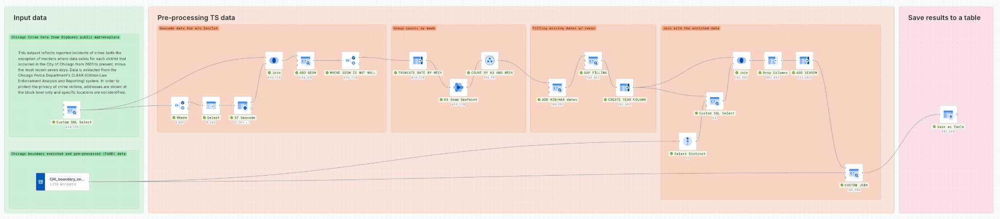

# GeoPython 2025 - Unlocking Smarter Property Risk Assessments with Spatio-Temporal Crime Insights and CARTO

---
> [!IMPORTANT]
> Please review [this](../README.md) information before starting the workshop.
---

Spatial Data Science is all about using methods and tools where location and time are key elements of the data. In this tutorial, we'll dive into working with large spatio-temporal datasets, tackling the unique challenges they present in data engineering, visualization, and statistical modeling.

We'll get hands-on with CARTO, showing you how to analyze the patterns and changes in violent crimes over time and space. Crime data is often an overlooked component in property risk assessments and rarely integrated into underwriting guidelines, despite the FBI's latest estimates indicating over $16 billion in losses annually from property crimes only.

More broadly, this practical session will help you see how insurers can use the results from this analysis to improve portfolio management by better assessing non-financial, location-based risks related to not just crime, but also to other perils, like floods, hurricanes, or hail.

Three key takeaways: 
- [x] How to take advantage of cloud native data warehouses to process, visualize, and analyze spatio-temporal big data
- [x] How to use CARTO to analyse and model the spatial distribution and temporal evolution of real-world datasets
- [x] How to use CARTO to create workflows and visualizations that provide decision-makers with easy access to critical insights

The workshop will be run using [CARTO Workflows](https://carto.com/workflows) and the [Goole Cloud Platform](https://cloud.google.com/). For CARTO newbies, Workflows is CARTO’s no-code / low-code solution. Some advantages of using Workflows instead of SQL is that we can have a single query doing everything without worrying about temporal tables (Workflows takes care of that) and provides a more natural way to link together the different steps: you will understand later once we start using some of [CARTO Analytics Toolbox](https://docs.carto.com/faqs/analytics-toolbox)’s functions that the nested queries become harder to grasp without previous experience using it.


---

## Presenting the Data

The data comes in three different source tables:

- **Violent crimes data**. The data we will be using contains information of reported incidents of crime that occurred in the City of Chicago from 2001 to present, minus the most recent seven days. Data is extracted from the Chicago Police Department's CLEAR (Citizen Law Enforcement Analysis and Reporting) system and is available in [Google BigQuery's public marketplace](https://cloud.google.com/bigquery/public-data). In order to protect the privacy of crime victims, addresses are shown at the block level only, and specific locations are not identified. The data can be found in the public table `bigquery-public-data.chicago_crime.crime`. 
- **Demographic and socio-economic data**. We will also be using American Community Survey (ACS) Data from the [CARTO Spatial Catalog](https://carto.com/data-observatory), which are publicly available at the block group resolution using [5-years estimates](https://carto.com/spatial-data-catalog/browser/?provider=usa_acs&search=5yrs) from 2007 to 2018 and then [1-years estimates](https://carto.com/spatial-data-catalog/browser/?provider=usa_acs&search=yearly) for 2019 and 2020. Additionally, we will include information about the urbanity level of different locations, which can be extracted from the [Spatial Features](https://carto.com/blog/announcing-new-carto-spatial-features-data) dataset, CARTO's globally available derived dataset.
- **Vacant buildings**. We will also use 311 calls for open and vacant buildings [reported to the City of Chicago](https://www.chicago.gov/city/en/depts/bldgs/dataset/vacant_and_abandonedbuildingsservicerequests.html) since January 1, 2010. This information is updated daily with the previous day's calls added to the records. The data set provides the date of the 311 service request and the unique Service Request number attached to each request. For each request, the following information (as reported by the 311 caller) is available: address location of building; whether building is vacant or occupied; whether the building is open or boarded; entry point if building is open; whether non-residents are occupying or using the building, if the building appears dangerous or hazardous and if the building is vacant due to a fire.
- **Holiday data**. This [BigQuery ML public dataset](https://cloud.google.com/blog/products/data-analytics/customized-holiday-modeling-with-bigquery-ml-forecasting) reports holiday data for a custom holiday region.

---
 
## Data pre-processing

For this use case, we are not interested in working with the individual reports. While we could use Census Block Groups, the units adopted by the ACS dataset, we will opt for a spatial index grid. This regular grid offers several advantages over the irregular polygons of Census Block Groups, particularly in terms of computation, storage, and visualization, as outlined in the next section.

### Spatial Indexes

Quoting CARTO's quickstart guide on Spatial Indexes:

> *Spatial Indexes are multi-resolution, hierarchical grids that are “geolocated” by a short reference string, rather than a complex geometry*

Spatial indexes are, therefore, some kind of IDs that always point to the same portion of land. We can also traverse a hierarchy of cells: having the ID of a cell, we can get the parent cell (a larger cell that contains the one we are working with) or the children cell (all the cells that are contained within it).

There are some obvious performance gains using spatial indexes:

- They are much **smaller to store**: they are represented with an integer or a string, so we save storing a full geometry in the database.
- They are more **natural for cloud data warehouses**: being an integer or a string, most operations can be run using a `JOIN` or a `GROUP BY` natively.
- They function as a **common ground for all your data**: no need to worry about how to mix your points, lines and geometries; we can almost always project these data to a continuous, deterministic and performant grid structure.

There are two main spatial indexes to take into account, that should cover a vast majority of the use cases:

- **H3**, which provides a hexagonal grid. The main advantage it provides is that, **for each and every cell, all of its neighbor's centroids are at the same distance of its own**. This is by definition of what a regular hexagon is and does not happen in quadrilateral shapes: the North neighbor is closer than the North-East one.
- On the other hand we have **Quadbin**, which provides a quadrangular grid. The advantage it has compared to H3 is that **each of the square cells are exactly subdivided in four children cells**. This is not the case in H3: hexagons cannot be cleanly subdivided in hexagonal children cells; the relation is approximate.

Except very specific use cases, most times it comes down to personal preference or the fact that hexagons look cool on a map. Today, since later we are going to use neighbor rings (K-rings), let's choose H3. Let's start by [polyfilling](https://docs.carto.com/carto-user-manual/workflows/components/spatial-indexes) the area of interest by creating an H3 grid of resolution 7 (about 1.2 km of edge length) of the whole city of Chicago, whose boundary is store in the public table `cartobq.docs.CHI_boundary`.

### Enrichment Functions

Next, we will intersect and enrich each H3 cells with selected ACS variables from all the available survey years, by specifying the most appropiate aggregation function for each variable, e.g. the `SUM` for extensive variables (which will vary as the size of a feature changes, like the total population) and the `AVG` for intensive variables (like the median income). The `ENRICH_GRID` component does exactly what we need for this. 

For extensive variables, which usually require the `SUM` aggregation, it will return (per cell):
- In case there is a single block group intersecting the cell: the areal proportion of the block group (if the cell intersects one third of the block group, it will get one third of the population).
- In case there are multiple block groups intersecting the cells: the sum of the areal proportions of all the block groups. 

Similarly, if we were using the `AVG` aggregation instead, we would get the weighted average based on the intersecting area, and if we were using the `MIN`/`MAX` function, we would get the minimum/maximum of the intersecting geometries. If we were using lines, it would use the length instead of the area and, if we were using points, the `COUNT` aggregation is often useful.

There is, however, another thing to take into account: these enrichment functions have been developed (at least by now) with a geographical intent in mind. We cannot use them as-is to enrich a grid that is also indexed by time (we would lose our date column by calling the `ENRICH_GRID` component, since it will keep a single row per H3). For this reason, we enrich the datasets for each survey years separately and then union all the results.

[](../sql/(1:)%20GeoPython25%20-%20Unlocking%20Smarter%20Property%20Risk%20Assessments%20with%20Spatio-Temporal%20Crime%20Insights%20and%20CARTO.sql)

Now we have projected the data into the H3 grid, but for extensive variables it is important to understand that in this way we have either aggregated or disaggregated the original census variables, which might result in fractional population counts: for example, in case a blockgroup spans across 4 different H3 cells, for each person living in that block group each will receive 0.25 people. This is a weird measurement, especially if we were to show this in a dashboard to end users, but it is perfectly fine for the analysis that we are going to perform.

### Dimensionality reduction

Before including the crime count data too, we want to reduce the dimensionality of the enriched data to reduce model complexity when using this data later on to model crime counts. 

To do do this, we can borrow some procedures from CARTO AT, which implement the Factorial Analysis of Mixed Data (FAMD) method developed by [Pagés (2004)](http://www.numdam.org/article/RSA_2004__52_4_93_0.pdf). This method generalizes the use of [Principal Component Analysis (PCA)](https://en.wikipedia.org/wiki/Principal_component_analysis) to account for the number of modalities available to each categorical/ordinal variable and on the probabilities of these modalities. Depending on the variable type, the procedure applies the following transformations to the input data:

- For numerical variables: standard scale the columns to get their z-scores
- For categorical variables:
  - One-hot-encode the categorical columns to get their indicator matrix
  - Weight each column by the inverse of the square root of its probability, given by the number of ones in each column (Ns) divided by the number of observations (N)
  - Center the columns
- For ordinal variables we can choose from different encoding methods and by apply the correspoding weight:
  - Categorical encoding: ordinal variables are hot-encoded and the columns of the resulting indicator matrix are then weighted and centered as in the FAMD method
  - Numerical encoding: ordinal variables are treated as numerical variables

This procedure is not available yet as a Workflows component, and therefore we have to include it in our workflow using a [`Call Procedure`](https://docs.carto.com/carto-user-manual/workflows/components/custom#call-procedure) component:

```sql
/*==================== BUILD_PCAMIX_DATA  ====================*/
DROP TABLE IF EXISTS `cartobq.sdsc24_ny_workshops.CHI_boundary_pca_model_data`;
CALL `carto-un`.carto.BUILD_PCAMIX_DATA(
  '''SELECT * FROM `$a`''',
  'uuid',
  ['median_age_avg',
  'median_rent_avg',
  'black_pop_sum',
  'hispanic_pop_sum',
  'owner_occupied_housing_units_median_value_sum',
  'vacant_housing_units_sum',
  'housing_units_sum',
  'families_with_young_children_sum'],
  NULL,
  ['urbanity_any_ordinal'],
  'cartobq.sdsc24_ny_workshops.CHI_boundary_pca',
  '''{
    "ordinal_encoding":"CATEGORICAL"
  '''
)

/*==================== BUILD_PCAMIX_MODEL  ====================*/
CALL `carto-un`.carto.BUILD_PCAMIX_MODEL(
  '''SELECT * FROM `cartobq.sdsc24_ny_workshops.CHI_boundary_pca_model_data`''',
  'uuid',
  'cartobq.sdsc24_ny_workshops.CHI_boundary_pca_model',
  '''{
    "NUM_PRINCIPAL_COMPONENTS":2
  }'''
);

CALL `carto-un`.carto.PREDICT_PCAMIX_SCORES(
  '''SELECT * FROM `cartobq.sdsc24_ny_workshops.CHI_boundary_pca_model_data`''',
  'uiid',
  'cartobq.sdsc24_ny_workshops.CHI_boundary_pca_model',
  'cartobq.sdsc24_ny_workshops.CHI_boundary_pca_scores'
)
```
From the code above, we can see that the urbanity variable, first transformed to an ordinal variable with the following schema


is treated as a categorical variable when including it in the procedure that prepares the input data ([`BUILD_PCAMIX_DATA`](https://docs.carto.com/data-and-analysis/analytics-toolbox-for-bigquery/sql-reference/statistics#build_pcamix_data)) for the dimensionality reduction analysis. Then, the [`BUILD_PCAMIX_MODEL`](https://docs.carto.com/data-and-analysis/analytics-toolbox-for-bigquery/sql-reference/statistics#build_pcamix_model) runs the PCA model with the transformed data, followed by [`PREDICT_PCAMIX_SCORES`](https://docs.carto.com/data-and-analysis/analytics-toolbox-for-bigquery/sql-reference/statistics#predict_pcamix_scores), which extracts the first two principal component scores (a.k.a. the transformed variables that account for most of the variance in the input data). 

[](../sql/(2:)%20GeoPython25%20-%20Unlocking%20Smarter%20Property%20Risk%20Assessments%20with%20Spatio-Temporal%20Crime%20Insights%20and%20CARTO.sql)

### Adding the temporal dimension

We next turn to processing the crimes data, which comes as individual reported crimes with the crime type, report date and location as given by the centroid of the corresponding Census block. To simplify the analysis, we will assume that the given coordinates are the exact coordinates of the crime, and when these are not available we will try to infer them using the [`ST Geocode`](https://docs.carto.com/carto-user-manual/workflows/components/spatial-constructors#st-geocode) component, using the block name as the address.

The crime data are then aggregated by intersecting the coordinates of each individual report with the H3 grid and then computing the total counts per H3 cell and week (although we could work with daily data, for this use case it is probably going to be far too sparse, and that's why we decided to aggregate the series in weekly steps instead).

Finally, the time series for each H3 cell is gap-filled by adding zeros for weeks without any reported crime and joined with the enriched data from the previous section using the closest ACS survey year.

[](../sql/(3:)%20GeoPython25%20-%20Unlocking%20Smarter%20Property%20Risk%20Assessments%20with%20Spatio-Temporal%20Crime%20Insights%20and%20CARTO.sql)

Here is a map where we can explore the final dataset:

[](https://clausa.app.carto.com/map/bd4561c9-2db2-4e5a-acd0-e8857f341893)

---

## Exploratory Analysis: space-time insights

As someone who works with spatial data, one of the most common types of questions you'll be asked will be about spatial trends or patterns. This is typically framed as the question "where is variable X highest and lowest?". While these questions can be explored cartographically - such as through choropleth maps which depict the value of a variable through color - it is often important to go beyond this with a quantitative measure of these spatial trends; hotspot analysis.

But what about space-time data? We need a statistics that allows you to add the extra dimension of time, by identifying not just where hotspots are, but where and when they are.

#### Space-time Getis-Ord

Getis-Ord is a family of statistics used to perform hotspot analysis: measures the value of a specific feature and how it correlates with its surroundings. The higher the value of the feature to measure in a cell, as well as the surrounding cells, the higher the $G_i^*$ statistic. This way, we have a better insight on what are the dynamics from a geographical point of view: we are smoothing the noise out of the visualization.

Space-time Getis-Ord iterates on this same concept, but adding time as a new dimension: now, the surroundings of a cell are not only its neighbors, but also the adjacent time steps (those same neighbors $N$ time steps before). If we had a 2D kernel before, now it is 3D. We can compute the space-time Getis-Ord statistics $G_i^*$ and its associated p-value using the [`Getis Ord Spacetime`](https://docs.carto.com/carto-user-manual/workflows/components/statistics#getis-ord-spacetime) component.

By computing this statistic, we can now check how different parts of the city become _hotter_ or _colder_ as time progresses. This is already insightful, but we have two more functions still that will help us extract more knowledge of this result.

[](https://clausa.app.carto.com/map/0b4c7bb7-967e-44b2-b020-c68518b0c89e)

#### Emerging Hotspots

There is yet another analysis we can apply to the space-time Getis-Ord results, that will digest the results into a single map based on several predefined categories:

| Category                 | Description                                                                                                                                                                                                                           |
| :----------------------- | :------------------------------------------------------------------------------------------------------------------------------------------------------------------------------------------------------------------------------------ |
| `Undetected Pattern`     | This category applies to locations that do not exhibit any discernible patterns of hot or cold activity as defined in subsequent categories.                                                                                          |
| `Incipient Hotspot`      | This denotes a location that has become a significant hotspot only in the latest observed time step, without any prior history of significant hotspot activity.                                                                       |
| `Sequential Hotspot`     | Identifies a location experiencing an unbroken series of significant hotspot activity leading up to the most recent time step, provided it had no such activity beforehand and less than 90% of all observed intervals were hotspots. |
| `Strengthening Hotspot`  | A location consistently identified as a hotspot in at least 90% of time steps, including the last, where there's a statistically significant upward trend in activity intensity.                                                      |
| `Stable Hotspot`         | Represents a location maintaining significant hotspot status in at least 90% of time steps without showing a clear trend in activity intensity changes over time.                                                                     |
| `Declining Hotspot`      | A location that has consistently been a hotspot in at least 90% of time steps, including the most recent one, but shows a statistically significant decrease in the intensity of its activity.                                        |
| `Occasional Hotspot`     | Locations that sporadically become hotspot, with less than 90% of time steps marked as significant hotspots and no instances of being a significant coldspot.                                                                         |
| `Fluctuating Hotspot`    | Marks a location as a significant hotspot in the latest time step that has also experienced significant coldspot phases in the past, with less than 90% of intervals as significant hotspots.                                         |
| `Legacy Hotspot`         | A location that isn't currently a hotspot but was significantly so in at least 90% of past intervals.                                                                                                                                 |
| `Incipient Coldspot`     | Identifies a location that is marked as a significant coldspot for the first time in the latest observed interval, without any previous history of significant coldspot status.                                                       |
| `Sequential Coldspot`    | A location with a continuous stretch of significant coldspot activity leading up to the latest interval, provided it wasn't identified as a coldspot before this streak and less than 90% of intervals were marked as coldspots.      |
| `Strengthening Coldspot` | A location identified as a coldspot in at least 90% of observed intervals, including the most recent, where there's a statistically significant increase in the intensity of low activity.                                            |
| `Stable Coldspot`        | A location that has been a significant coldspot in at least 90% of intervals without any discernible trend in the intensity of low activity over time.                                                                                |
| `Declining Coldspot`     | Locations that have been significant coldspots in at least 90% of time steps, including the latest, but show a significant decrease in low activity intensity.                                                                        |
| `Occasional Coldspot`    | Represents locations that sporadically become significant coldspots, with less than 90% of time steps marked as significant coldspots and no instances of being a significant hot spot.                                               |
| `Fluctuating Coldspot`   | A location marked as a significant coldspot in the latest interval that has also been a significant hot spot in past intervals, with less than 90% of intervals marked as significant coldspots.                                      |
| `Legacy Coldspot`        | Locations that are not currently coldspots but were significantly so in at least 90% of past intervals.                                                                                                                               |

To run this classification, we can use the [`Spacetime Hotspots Classification`](https://docs.carto.com/carto-user-manual/workflows/components/statistics#spacetime-hotspots-classification) component, which takes the output of `Getis Ord Spacetime` and classifies each location into specific types of hotspots or coldspots, based on patterns of spatial clustering and intensity trends over time.

[](https://clausa.app.carto.com/map/479f88ec-f8af-48c6-ad62-448679452c10)

We can see how now we have the different types of behaviors at a glance in a single map. There are several insights we can extract from this map:

- There is an large stable hotspot near West Garfield Park, one of [Chicago's most violent neighborhoods](https://graphics.suntimes.com/2023/chicago-most-violent-neighborhood-garfield-park-residents-stories/).
- The periphery of the city is mostly cold spots, with some stable coldspots in the north east suburban villages and many fluctuating coldspots in the South Suburbs.
- Englewood which historically has struggled with high levels of violent crime, is classified as a declining hotspot, which might reflect the effects of  the initial phase of the recent Chicago’s [INVEST South/West commercial corridor improvement strategy](https://www.chicago.gov/city/en/sites/invest_sw/home/greater-englewood.html)

Here is the complete workflow:

[](../sql/(4:)%20GeoPython25%20-%20Unlocking%20Smarter%20Property%20Risk%20Assessments%20with%20Spatio-Temporal%20Crime%20Insights%20and%20CARTO.sql)

### Time Series Clustering

Once we have an initial understanding of the spacetime patterns of our data, we can also try to cluster H3 cells based on their temporal patterns using the [`Cluster Time Series`](https://docs.carto.com/carto-user-manual/workflows/components/statistics#cluster-time-series) component. This component allows to generate $N$ clusters of time series, using different clustering methods. Right now, it features two very simple approaches:

- **Value characteristic**, that will cluster the series based on the step-by-step distance of its values (the closer the signals, the closer the series). This method applies a [K-means clustering](https://en.wikipedia.org/wiki/K-means_clustering) using the [Euclidean distance](https://en.wikipedia.org/wiki/Euclidean_distance).
- **Profile characteristic**, that will cluster the series based on their dynamics along the time span passed (the closer the correlation, the closer the series). This method applies a [K-means clustering](https://en.wikipedia.org/wiki/K-means_clustering) using the [Cosine distance](https://en.wikipedia.org/wiki/Cosine_similarity).

[](../sql/(5:)%20GeoPython25%20-%20Unlocking%20Smarter%20Property%20Risk%20Assessments%20with%20Spatio-Temporal%20Crime%20Insights%20and%20CARTO.sql)

The following maps show the different clusters that are returned as a result using the value (_top_) and profile (_bottom_) characteristics:

[](https://clausa.app.carto.com/map/efb99df1-ea89-4059-907f-81814e1b1695)

[](https://clausa.app.carto.com/map/a2d0ecf9-5515-401a-bbfe-66cec291e5a3)

We can identify the different dynamics according to the selected clustering method:

- When clustering using the `VALUE` method, we can clearly identify areas with very different crime levels, from group `yellow` with very high-levels to group `purple` with very low values.
- Using the `PROFILE` method, we can identify groups of time series with different seasonalities and trends (e.g. `purple` and `green` are characterized by a large seasonal cycle with different trends from 2008 on, while `yellow` and `blue` do not show any seasonal variability, with `yellow` showing a (slight) upward trend from 2017 onwards).

---

## Inferential analysis

Building on the insights gained from the exploratory analysis, the next step involves performing inferential analysis to draw conclusions and make predictions about the broader population based on the available data.

### Getting the estimated counts 

First, we aim to estimate the expected counts per 1000 people, conditional on selected covariates. The reason for modeling crime rates per 1000 people instead of total counts is to focus on the risk or probability of an individual being affected by a crime, rather than just the raw number of crimes. By adjusting for population, you get a more accurate measure of risk (how likely it is for someone to experience a crime) instead of being misled by larger populations that might have more total crimes but not necessarily a higher risk.

In addition to the first two principal component scores derived from external data (ACS and CARTO Spatial Features), we can also add endogenous variables. These include:
- **Spatial lag** variables to account for the influence of neighboring regions, since outcomes in one area may affect outcomes in nearby areas due to spatial interactions or spillover effects.
- Counts at previous **time lags** to model the impact of past values on current or future outcomes, capturing autocorrelation.
- **Seasonal terms** to account for repeating seasonal behaviors, which can be represented as Fourier terms by summing sine and cosine functions of different frequencies.

[](../sql/(6:)%20GeoPython25%20-%20Unlocking%20Smarter%20Property%20Risk%20Assessments%20with%20Spatio-Temporal%20Crime%20Insights%20and%20CARTO.sql)

Next, we can import a [pre-trained](https://cloud.google.com/bigquery/docs/reference/standard-sql/bigqueryml-syntax-create-onnx) statistical model into BigQuery to estimate the crime counts for the latest version of the data. While we could train a similar model using [BigQuery ML](https://cloud.google.com/bigquery/docs/reference/standard-sql/bigqueryml-syntax-create), importing a pre-trained model allows for an implementation within a Python/PyTorch/TensorFlow environment, which many Data Scientists prefer. The pre-trained model is a linear regression model, designed to estimate the ratio of crime counts per 1000 people based on the selected covariates and is saved in [ONNX format](https://onnx.ai/) in Google Cloud Storage (GCS) in [this public bucket](https://storage.googleapis.com/sdsc_workshops/sdsc24_10/onnx_models/model_lr_encode_holiday.onnx). A notebook, with the code to train the model and save it to GCS is available [here](../materials/train_sklearn_model_onnx_gcs.ipynb). 

To import the model into BigQuery and make predictions, we will use the [BigQuery ML Extension Package](https://carto.com/blog/bigquery-ml-carto-supercharge-spatial-analysis-with-ai): a set of components that allow users to exploit [BigQuery’s ML capabilities](https://cloud.google.com/bigquery/docs/bqml-introduction) directly from Workflows, enabling a seamless integration of machine learning models into automated pipelines. For details about installing and managing Extension Packages, please take a look at the [documentation](https://docs.carto.com/carto-user-manual/workflows/extension-packages).

To run predictions, simply copy the file path to the model in GCS (the gsutil URI) `gs://sdsc_workshops/sdsc24_10/onnx_models/model_lr_encode_holiday.onnx` within the [Import Model](https://docs.carto.com/carto-user-manual/workflows/components/bigquery-ml#import-model) component and connect it to the [Predict](https://docs.carto.com/carto-user-manual/workflows/components/bigquery-ml#predict) component.

[](../sql/(7:)%20GeoPython25%20-%20Unlocking%20Smarter%20Property%20Risk%20Assessments%20with%20Spatio-Temporal%20Crime%20Insights%20and%20CARTO.sql)

This map shows the observed and estimated counts for the ten H3 cells with the highest number of crimes over all the period:

[](https://clausa.app.carto.com/map/5f079a6a-e389-4b2e-af2f-f30470bad6c5)


### Detect space-time anomalies

Finally, let's use the estimated counts to detect space-time anomalies (i.e. that affect time series from multiple locations simultaneously) in the most recent timespan. For this task, we can use the [`Detect Space-time Anomalies`](https://docs.carto.com/carto-user-manual/workflows/components/statistics#detect-space-time-anomalies) component, which has been designed specifically for time series that are also localized in space. In this case, we expect that, if a given location is affected by an anomalous event, then, nearby locations are more likely to be affected than locations that are spatially distant.

Using this component, we search over a large and overlapping set of space-time regions, each containing some subset of the data, and find the most significant clusters of anomalous data. This approach, which is known as the [generalized space-time scan statistics framework](https://www.cs.cmu.edu/~neill/papers/ijf.pdf), which consists of computing a score function that compares the probability that a space-time region _S_ is anomalous compared to some baseline to the probability of no anomalous regions. The region(s) with the highest value of the score for which the result is significant for some significance level are identified as the (most) anomalous.

Although, the are many formulations of the definition of anomalous, unexpected, or otherwise interesting regions, in this case we are interested in assuming that, under the null hypothesis of no anomalous space-time regions, the observed values should be equal to the baseline values given by the expected counts estimated in the previous section. To do this, we will focus the search of emerging _high mean_ anomalies (values larger than expected) only on the final part of the time series (_prospective analysis_), with spatial extent given by a k-ring size between 1 (first order neighbors) and 2 (second order neighbors) and a temporal extent between 4 and 8 weeks. 

We then select the region with the highest score, and unnest the results to match the H3 IDs and timestamps associated with the anomalous region ID (`index_scan`) with the corresponding counts and baseline values.

[](../sql/(8:)%20GeoPython25%20-%20Unlocking%20Smarter%20Property%20Risk%20Assessments%20with%20Spatio-Temporal%20Crime%20Insights%20and%20CARTO.sql)

Finally, we can use this workflow to identify which [open and vacant buildings](https://www.chicago.gov/city/en/depts/bldgs/dataset/vacant_and_abandonedbuildingsservicerequests.html) fall within the anomalous detected region.

[](../sql/(9:)%20GeoPython25%20-%20Unlocking%20Smarter%20Property%20Risk%20Assessments%20with%20Spatio-Temporal%20Crime%20Insights%20and%20CARTO.sql)

[](https://clausa.app.carto.com/map/71df07d0-99e0-47fa-885f-1eae4dffcd89)

Detecting vacant buildings in areas experiencing a surge in crime can be highly beneficial for a real estate insurance company. Vacant properties are more vulnerable to vandalism, theft, and arson, which can lead to costly claims. By identifying such properties in high-crime areas, insurance companies can proactively assess risk, adjust coverage rates, or offer specialized policies for property owners. This insight enables better risk management and helps insurers mitigate potential losses, ultimately improving the accuracy of underwriting decisions and enhancing profitability.

---

## Closing Thoughts

In this workshop, we have explored how spatial data science can be applied to analyze large spatio-temporal datasets, using crime data as a practical example. By leveraging tools like CARTO and Google Cloud Platform, we’ve seen how distributed computing and geospatial analytics can help overcome the unique challenges of handling and interpreting large-scale data. These insights are invaluable not just for urban planners and law enforcement, but also for industries like insurance companies, for which understanding the spatial dynamics of risks such as crime, natural disasters, and environmental hazards is critical.
