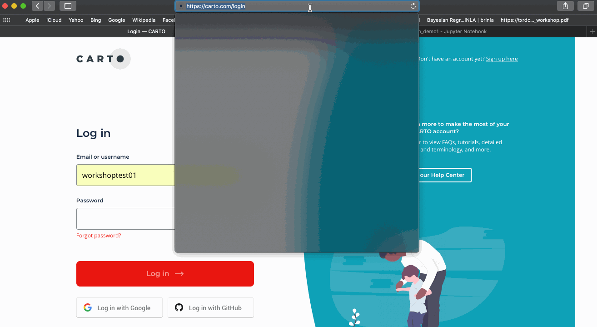

# SDSC20. Integrating CARTOframes into Spatial Data Science workflows

October 21st 2020

Giulia Carella (giulia@carto.com) & Miguel Álvarez (malvarez@carto.com)

This repository contains the material for the workshop *Integrating CARTOframes into Spatial Data Science workflows*. It includes:

- A deck with the slides used during the workshop
- Two jupyter notebooks used for the practical session (links to satic previews can be found below)

## Installation requirements

To run the notebooks, please follow the instructions below.

1. Download or clone this repository. To download the repository click the **Code** button and **Download ZIP**. Otherwise, if you have git installed, you can clone it.

  ```bash
  $ git clone git@github.com:CartoDB/research-public.git
  ```
  
3. Install python (follow instructions here: https://docs.anaconda.com/anaconda/install/) and jupyter (follow instructions here: https://jupyter.readthedocs.io/en/latest/install.html)

3. Open your terminal, go to **scsc20-workshop-cartoframes** and run 
  ```bash
  $ jupyter notebook
  ```

4. This will open a new window in your browser, where you will see two jupyter notebooks for the practical session

	- `demo1-site_planning/site_planning.ipynb` ([static preview](https://nbviewer.jupyter.org/github/CartoDB/research-public/blob/master/scsc20-workshop-cartoframes/demo1-site_planning/site_planning.ipynb?flush_cache=True)): where should Starbucks open new coffee shops in Long Island, NY? In this demo we will go through a typical site selection use case, from modelling the revenues of the existing stores as a function of socioeconomic covariates, to predicting the potential revenues in new locations.  

	- `demo2-optimization/logistics_optimization.ipynb` ([static preview](https://nbviewer.jupyter.org/github/CartoDB/research-public/blob/master/scsc20-workshop-cartoframes/demo2-optimization/logistics_optimization.ipynb?flush_cache=True)): where should a parcel delivery company locate their distribution and fulfilment centers? What areas should they service? In this demo we will go through a supply chain network optimization use case, from analysing past data to identifying spatio-temporal patterns to building an optimization model to analyze and quantify the impact of changes in the current network.

### CARTO account

**Note** that the analyses we'll work on use data from CARTO's [Data Observatory](https://carto.com/spatial-data-catalog/). In order to run them, a CARTO account is needed. You can [create a free CARTO account](https://carto.com/signup) and experience CARTO's tech stack firsthand for 12 months. You can also follow the workshop using the static previews linked above.

Once you have a CARTO account

1. Go to https://carto.com/login

2. Enter your username and password and click Log In. You will be prompted to your CARTO dashboard

3. Click on the icon on the top right corner, and then on API Keys to visualize your Master Key. To run the demos during the practical session you will only need your username and API Key. For more details, please check this video



4. Once you have your credentials, you can then start using CARTO:

	- CARTO Builder: load data and create beautiful maps directly from your Dashboard.
	https://carto.com/help/tutorials/getting-started-with-carto-builder/

	-  CARTOframes: A Python package for integrating CARTO maps, analysis, and data services into data science workflows.
	https://carto.com/developers/cartoframes/
	 


