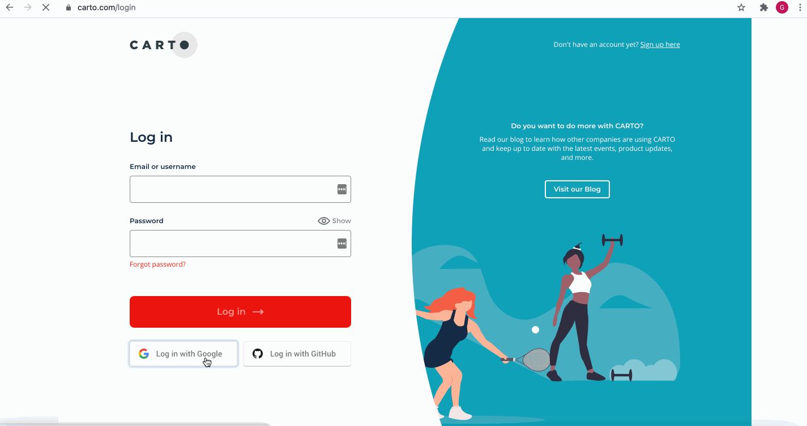

# SDSC21. Unlocking Spatial Analytics in the cloud with CARTO

October 27th 2021

Miguel Álvarez (malvarez@carto.com) and Giulia Carella (giulia@carto.com)

This repository contains the material for the workshop *Unlocking Spatial Analytics in the cloud with CARTO*. It includes:

- A deck with the slides used during the workshop
- Two jupyter notebooks used for the practical session (links to static previews can be found below)

## Requirements

Importante note: the requirements as detailed below will change soon, when CARTO2 will be replaced by CARTO3.
  
1. [Create a Google Bigquery account](https://cloud.google.com/bigquery/).

2. [Create or access your CARTO3 account](https://app.carto.com/signup) and [connect your Google Bigquery account](https://docs.carto.com/carto-user-manual/connections/creating-a-connection/#connection-to-bigquery). A free 14-days trial for CARTO3 workspace is available.

3. Subscribe to public data in [CARTO Data Observatory](https://carto.com/spatial-data-catalog/):

	- [Create or access your CARTO2 account](https://carto.com/login). 

	- Enter your username and password and click Log In. You will be prompted to your CARTO2 dashboard.

	- To subscribe to the open access dataset used in the second use case go to Data -> Your Subscriptions -> New Subscription -> Search for _Spatial Features - United States of America (Quadgrid 15)_ -> Subscribe for free. To find the name of the table in Google Bigquery where the subscribed data are stores, go to QUICK ACTIONS -> Access in Bigquery.

## Contents

- `demo_sdsc21_logistics.ipynb.ipynb` ([static preview](https://nbviewer.org/github/CartoDB/research-public/blob/master/scsc21-workshop-analytics-toolbox/demo_sdsc21_logistics.ipynb)). How far do people living in Queens, NYC travel by taxi? Which are the most frequent routes? In this demo, using CARTO Analytics Toolbox, we will visualize trip data using spatial indices, generate simplified networks, and calculate routes and road frequencies.

- `demo_sdsc21_real_estate.ipynb` ([static preview](https://nbviewer.org/github/CartoDB/research-public/blob/master/scsc21-workshop-analytics-toolbox/demo_sdsc21_real_estate.ipynb)). Where are residents paying more house taxes in Providence, Rhode Island? In this demo, using CARTO Analytics Toolbox, we will go through a typical real estate use case, from enriching data on property taxes with demographic, socio-economic, and points of interests data, to perform a hotspot analysis and visualize the results.
